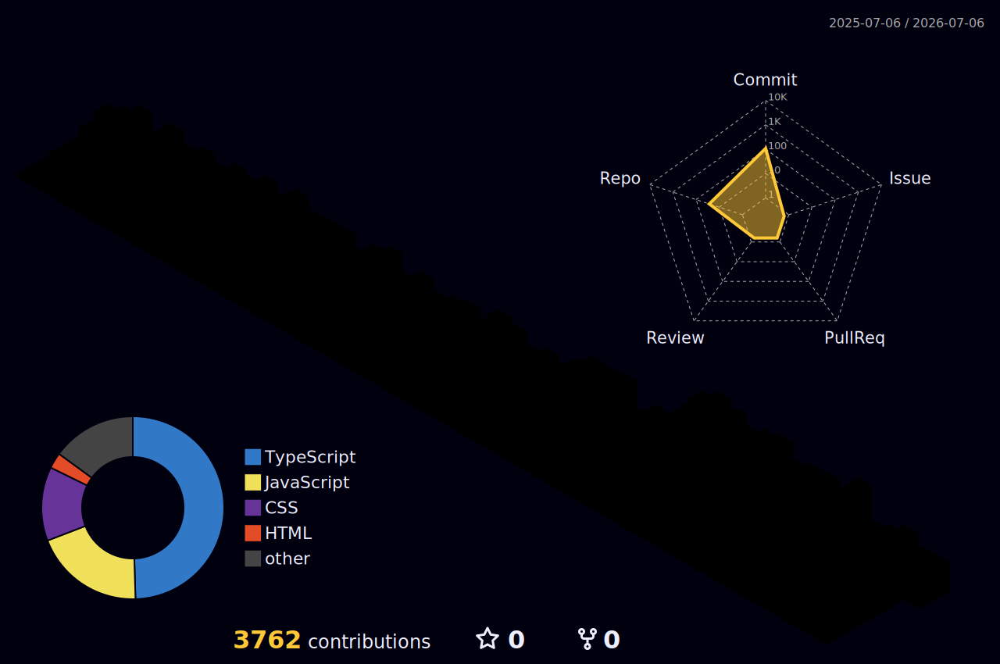

<h1 align="center">Mohammed Junaid</h1>

<h3 align="center">
Software Engineer • Security-Focused Full Stack Developer • AI-Powered SaaS Builder
</h3>

<p align="center">
  
</p>

<p align="center">
  
</p>

---

# 🚀 About Me

I am a software engineer focused on building secure, scalable and production-ready systems.

My work combines:

- 🔐 Security Engineering
- ☁️ Cloud Architecture
- 🤖 AI-Powered Applications
- 🌐 Full Stack Development
- 📊 Data & Workflow Automation

I enjoy designing products where security, performance and user experience are treated as first-class requirements rather than afterthoughts.

Currently focused on:

- Building multi-tenant SaaS platforms
- AI-assisted verification and reporting systems
- Secure document workflows
- Encryption-first applications
- Cloud-native architectures

---

# 🎯 Current Focus

```text
Security Engineering      ████████████████████ 100%
Full Stack Development    ████████████████████ 100%
System Design             ███████████████████░ 95%
Cloud Architecture        ██████████████████░░ 90%
Artificial Intelligence   █████████████████░░░ 85%
DevOps & Automation       ████████████████░░░░ 80%
```

---

# 🧠 Engineering Philosophy

> Security is not a feature.
>
> It is part of the architecture.

### Core Principles

- Build secure systems by default
- Encrypt data before storing it
- Design for scale from day one
- Automate repetitive operations
- Keep architectures simple but extensible
- Prioritize maintainability over cleverness

---

# ⚡ Tech Stack

## Languages

<p>

</p>

## Frontend

<p>

</p>

## Backend

<p>

</p>

## Databases

<p>

</p>

## Cloud & Infrastructure

<p>

</p>

## AI & Data

<p>

</p>

## Tools

<p>

</p>

---

# 🔐 Security Expertise

### Areas of Interest

- Authentication & Authorization
- Role Based Access Control (RBAC)
- Multi-Tenant SaaS Security
- Client-Side Encryption
- Zero-Knowledge Architectures
- Secure File Storage
- JWT Security
- OWASP Top 10
- Secure API Design
- Cloud Security

---

# ☁️ Cloud & AI Certifications

## Oracle Cloud

🏆 Oracle Cloud Infrastructure 2025 Certified Multicloud Architect Professional

🏆 Oracle Cloud Infrastructure 2025 Certified DevOps Professional

🏆 Oracle Cloud Infrastructure 2025 Certified Generative AI Professional

## Artificial Intelligence

🏆 IBM Artificial Intelligence Fundamentals

🏆 Capgemini AI for Skilling Digital Academy

---

# 📈 What I'm Building

### 🏛 IQAC Portal
Multi-tenant AI-powered quality assurance platform for educational institutions.

### 🔐 Veil
Zero-knowledge encrypted cloud storage platform.

### ⛽ GaugeIQ
Vehicle analytics and expense intelligence system.

### 🔒 Vaultara
Browser-based large-file encryption platform.

---

# 🚀 Featured Projects

---

## 🏛 IQAC Portal

### AI-Powered Multi-Tenant Quality Assurance Platform

<p align="center">
  <a href="https://iqac.app">
    
  </a>
</p>

<p align="center">
  
</p>

A production-grade SaaS platform designed for colleges and educational institutions to manage Internal Quality Assurance Cell (IQAC) operations at scale.

The platform combines workflow automation, document intelligence, AI verification, reporting systems, tenant isolation, role-based security and cloud storage into a single integrated system.

### Key Features

- Multi-tenant architecture
- AI-powered document verification
- Department workflow management
- Event lifecycle management
- Role-based access control
- AI report generation
- Messaging and notifications
- Audit logging
- Backup management
- Analytics dashboard
- Cloud document storage
- PostgreSQL Row-Level Security

### Architecture Highlights

- Next.js 15
- React 19
- TypeScript
- Express.js
- PostgreSQL
- Prisma ORM
- FastAPI
- Cloudflare R2
- JWT Authentication
- Multi-Tenant RBAC

### Security Features

- Tenant-level data isolation
- PostgreSQL RLS policies
- Secure cookie authentication
- CSRF protection
- CORS allowlists
- Input sanitization
- Rate limiting
- Audit logging
- HTTPS enforcement
- Role-based authorization

### What Makes It Interesting

Unlike traditional college management software, IQAC Portal introduces AI-assisted verification and reporting workflows that reduce manual review overhead while maintaining institutional governance and accountability.

---

## 🔐 Veil

### Zero-Knowledge Encrypted Cloud Storage

<p align="center">
  <a href="https://veil-secure.vercel.app">
    
  </a>
</p>

<p align="center">
  
</p>

A browser-first encrypted storage platform where encryption happens entirely on the client side before files leave the user's device.

### Core Features

- AES-256-GCM encryption
- Client-side encryption workflow
- PBKDF2 key derivation
- Chunked file processing
- Large file support
- Secure sharing architecture
- Progressive Web App support
- Cloudflare R2 integration

### Technical Highlights

- Web Crypto API
- Supabase Authentication
- Supabase Database
- Cloudflare R2
- Zero-Knowledge Architecture
- Memory-efficient processing

### Security Design

The server never receives plaintext files or encryption keys.

Only encrypted data is stored, ensuring that even infrastructure operators cannot access user content.

---

## ⛽ GaugeIQ

### Vehicle Analytics & Expense Intelligence Platform

<p align="center">
  <a href="https://gauge-iq.vercel.app">
    
  </a>
</p>

<p align="center">
  
</p>

A full-stack analytics platform built to help users monitor fuel usage, mileage efficiency and long-term vehicle expenses.

### Features

- Fuel tracking
- Mileage analytics
- Expense management
- Performance insights
- Dashboard visualizations
- Historical reporting
- Authentication system
- Responsive UI

### Technical Highlights

- React
- TypeScript
- Supabase
- PostgreSQL
- Analytics Dashboards
- Relational Data Modeling

---

## 🔒 Vaultara

### Browser-Based File Encryption Platform

<p align="center">
  <a href="https://microdoomz.github.io/vaultara">
    
  </a>
</p>

<p align="center">
  
</p>

A privacy-focused browser application for encrypting large files directly inside the browser.

### Features

- AES-256 Encryption
- Browser-only processing
- Recovery key support
- Large file handling
- Secure downloads
- No server-side processing

### Technical Highlights

- Web Crypto API
- JavaScript
- Secure File Processing
- Client-Side Cryptography

---

# 🏆 Certifications

## Oracle Cloud Infrastructure

🥇 OCI 2025 Certified Multicloud Architect Professional

🥇 OCI 2025 Certified DevOps Professional

🥇 OCI 2025 Certified Generative AI Professional

---

## Artificial Intelligence

🤖 IBM Artificial Intelligence Fundamentals

🤖 Capgemini AI for Skilling Digital Academy

---

# 📚 Currently Learning

### Cloud & Infrastructure

- Advanced Cloud Architecture
- Multi-Cloud Deployments
- Distributed Systems
- Containerized Infrastructure

### Security

- Secure SaaS Architecture
- Identity & Access Management
- Cloud Security Engineering
- Application Security

### Artificial Intelligence

- LLM Integration
- Retrieval-Augmented Generation
- AI Agents
- AI-Powered Workflow Automation

---

# 💼 Highlights

### Engineering

✅ Built production-grade multi-tenant SaaS platform

✅ Designed zero-knowledge encrypted cloud storage

✅ Implemented AI-powered verification workflows

✅ Developed secure document intelligence systems

✅ Built cloud-native architectures using modern web technologies

---

# 📊 By The Numbers

```text
Projects Built              15+
Production Deployments      10+
Cloud Certifications        3
AI Certifications           2
Years Coding                4+
Lines of Code               100,000+
Coffee Consumed             ∞
```

---

# 🎯 2026 Goals

- Launch IQAC Portal across multiple institutions
- Expand AI-powered workflow automation systems
- Build additional SaaS products
- Deepen cloud architecture expertise
- Contribute to open-source projects
- Explore distributed systems at scale

---

# 📊 GitHub Analytics

<p align="center">
  
  
</p>

<p align="center">
  
</p>

---

# 🏆 GitHub Trophies

<p align="center">
  
</p>

---

# 📈 Contribution Activity

<p align="center">
  
</p>

---

# 🐍 Contribution Snake

> Create a workflow later to generate the snake animation automatically.

<p align="center">
  
</p>

---

# 🌟 3D Contribution Calendar

<p align="center">
  
</p>

---

# ⚙️ Development Environment

```yaml
OS: Windows 11
Editor: VS Code
Terminal: PowerShell
Languages:
  - TypeScript
  - JavaScript
  - Python
  - Java
Database:
  - PostgreSQL
Backend:
  - Node.js
  - Express
  - FastAPI
Frontend:
  - React
  - Next.js
Cloud:
  - Cloudflare
  - Vercel
Architecture:
  - Multi-Tenant SaaS
  - AI Workflows
  - Secure Cloud Systems
```

---

# 🌌 Engineering Interests

<table>
<tr>
<td>

### 🔐 Security

- Application Security
- Secure Architecture
- Encryption Systems
- Identity & Access Management
- Zero Knowledge Systems

</td>
<td>

### ☁️ Cloud

- Cloud Architecture
- Infrastructure Design
- Multi-Cloud Systems
- SaaS Platforms
- Distributed Systems

</td>
</tr>

<tr>
<td>

### 🤖 Artificial Intelligence

- LLM Integrations
- AI Agents
- AI Verification
- Retrieval Systems
- Workflow Automation

</td>
<td>

### 🚀 Product Engineering

- Full Stack Systems
- Platform Development
- Performance Optimization
- Scalability
- System Design

</td>
</tr>
</table>

---

# 📍 Current Mission

```text
Build secure and intelligent software systems
that solve real-world problems at scale.
```

---

# 🌐 Connect With Me

<p align="center">

<a href="https://www.linkedin.com/in/mohammed-junaid7">

</a>

<a href="https://microdoomz.github.io/portfolio/">

</a>

<a href="mailto:junaidmohammad232@gmail.com">

</a>

</p>

---

# 💜 Fun Zone

<p align="center">
  
</p>

<p align="center">
  
</p>

---

# 👀 Profile Visitors

<p align="center">
  
</p>

---

# 📫 Open To

- Software Engineering Opportunities
- Full Stack Development Roles
- AI Engineering Roles
- Cloud Engineering Roles
- Freelance Projects
- SaaS Collaborations
- Open Source Contributions

---

<p align="center">
  

  <br/>

  <b>Security First • Cloud Native • AI Powered</b>

  <br/><br/>

  ⭐ If you like my work, consider starring a repository.

</p>
